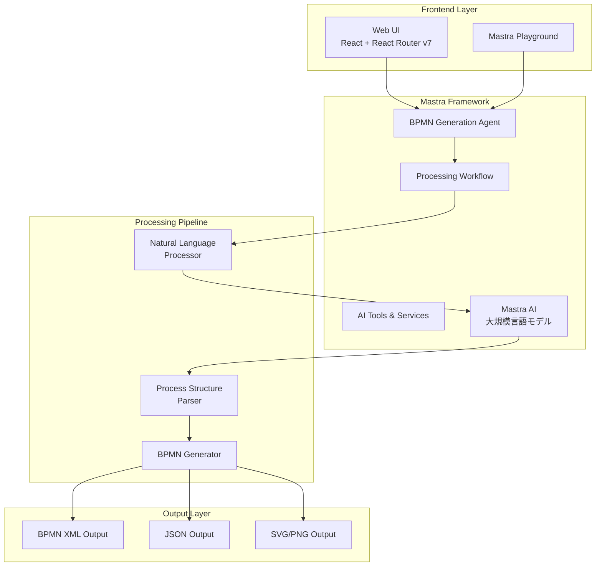

# Design Document

## Overview

自然言語からBPMN図を自動生成するシステムは、日本語で記述されたビジネスプロセス説明をAIで解析し、標準的なBPMN 2.0形式の図を生成します。システムはMastraフレームワークを基盤とし、開発者向けのプレイグラウンド環境とエンドユーザー向けのWebUIの両方を提供します。

## Architecture

### モノレポ構成

```
packages/
├── web-ui/                 # React + React Router v7 フロントエンド
├── mastra-agent/          # Mastraエージェント実装
├── nlp-processor/         # 自然言語処理サービス（Mastra統合）
├── bpmn-generator/        # BPMN生成サービス
└── shared-types/          # 共通型定義
```

### システム全体構成



### 処理フロー

1. **入力受付**: WebUIまたはプレイグラウンドから日本語プロセス説明を受信
2. **自然言語解析**: Mastra統合AI（大規模言語モデル）を使用してプロセス要素（タスク、条件、フロー）を抽出
3. **構造化**: 抽出した要素をBPMN構造に変換
4. **BPMN生成**: 標準的なBPMN XMLを生成
5. **出力**: XML、JSON、画像形式で出力

## Components and Interfaces

### 1. BPMN Generation Agent (Mastraエージェント)

**責務**: 全体的な処理フローの制御とAI処理の管理

```typescript
interface BPMNGenerationAgent {
  generateBPMN(input: NaturalLanguageInput): Promise<BPMNOutput>
  validateInput(input: string): boolean
  handleError(error: ProcessingError): ErrorResponse
}

interface NaturalLanguageInput {
  text: string
  language: 'ja'
  options?: GenerationOptions
}

interface BPMNOutput {
  xml: string
  json: BPMNStructure
  svg?: string
  png?: string
  metadata: GenerationMetadata
}
```

### 2. Natural Language Processor (Mastra AI)

**責務**: 日本語プロセス説明の解析と要素抽出

```typescript
interface NaturalLanguageProcessor {
  extractProcessElements(text: string): Promise<ProcessElements>
  identifyFlowPatterns(text: string): Promise<FlowPattern[]>
  detectConditions(text: string): Promise<Condition[]>
}

interface AIConfig {
  provider: 'openai' | 'anthropic' | 'bedrock'
  model: string
  maxTokens: number
  temperature: number
}

interface MastraAIService {
  generateBPMN(prompt: string, config: AIConfig): Promise<string>
  streamGeneration(prompt: string, config: AIConfig): AsyncIterable<string>
}

interface ProcessElements {
  startEvents: StartEvent[]
  tasks: Task[]
  gateways: Gateway[]
  endEvents: EndEvent[]
  flows: SequenceFlow[]
}

interface Task {
  id: string
  name: string
  type: 'userTask' | 'serviceTask' | 'scriptTask'
  description?: string
}

interface Gateway {
  id: string
  type: 'exclusive' | 'inclusive' | 'parallel'
  condition?: string
}
```

### 3. Process Structure Parser

**責務**: 抽出された要素をBPMN構造に変換

```typescript
interface ProcessStructureParser {
  buildProcessStructure(elements: ProcessElements): Promise<BPMNStructure>
  validateStructure(structure: BPMNStructure): ValidationResult
  optimizeLayout(structure: BPMNStructure): BPMNStructure
}

interface BPMNStructure {
  process: {
    id: string
    name: string
    elements: BPMNElement[]
    flows: SequenceFlow[]
  }
  diagram: DiagramInfo
}
```

### 4. BPMN Generator

**責務**: BPMN構造から標準形式の出力を生成

```typescript
interface BPMNGenerator {
  generateXML(structure: BPMNStructure): string
  generateJSON(structure: BPMNStructure): object
  generateSVG(structure: BPMNStructure): string
  generatePNG(structure: BPMNStructure): Buffer
}
```

### 5. Web UI Components (React Router v7)

**責務**: エンドユーザー向けのインターフェース

```typescript
// React Router v7 ルート定義
interface AppRoutes {
  '/': HomePage
  '/generate': GeneratePage
  '/samples': SamplesPage
  '/edit/:id': EditPage
}

interface WebUIComponents {
  InputPanel: React.FC<{onSubmit: (text: string) => void}>
  BPMNViewer: React.FC<{bpmnXML: string, editable: boolean}>
  OutputPanel: React.FC<{outputs: BPMNOutput}>
  SampleSelector: React.FC<{onSelect: (sample: string) => void}>
}

// pnpmワークスペース設定
interface MonorepoStructure {
  'packages/web-ui': ReactRouterApp
  'packages/mastra-agent': MastraService
  'packages/nlp-processor': NLPService
  'packages/bpmn-generator': BPMNService
}
```

## Data Models

### BPMN要素の基本構造

```typescript
// 基本BPMN要素
interface BPMNElement {
  id: string
  name?: string
  type: BPMNElementType
  position: Position
  properties?: Record<string, any>
}

type BPMNElementType = 
  | 'startEvent'
  | 'endEvent' 
  | 'task'
  | 'userTask'
  | 'serviceTask'
  | 'exclusiveGateway'
  | 'inclusiveGateway'
  | 'parallelGateway'

interface Position {
  x: number
  y: number
  width?: number
  height?: number
}

// シーケンスフロー
interface SequenceFlow {
  id: string
  sourceRef: string
  targetRef: string
  name?: string
  condition?: string
}

// プロセス定義
interface ProcessDefinition {
  id: string
  name: string
  isExecutable: boolean
  elements: BPMNElement[]
  flows: SequenceFlow[]
}
```

### 自然言語解析結果

```typescript
interface AnalysisResult {
  processName: string
  actors: Actor[]
  activities: Activity[]
  conditions: Condition[]
  flows: FlowConnection[]
  confidence: number
}

interface Actor {
  name: string
  role: string
  tasks: string[]
}

interface Activity {
  name: string
  type: 'manual' | 'automated' | 'decision'
  description: string
  prerequisites?: string[]
}

interface Condition {
  expression: string
  trueFlow: string
  falseFlow?: string
  type: 'exclusive' | 'inclusive'
}
```

## Error Handling

### エラー分類と対応

```typescript
enum ErrorType {
  INVALID_INPUT = 'INVALID_INPUT',
  PARSING_FAILED = 'PARSING_FAILED',
  GENERATION_FAILED = 'GENERATION_FAILED',
  VALIDATION_FAILED = 'VALIDATION_FAILED',
  AI_SERVICE_ERROR = 'AI_SERVICE_ERROR'
}

interface ErrorHandler {
  handleInputError(error: InputError): UserFriendlyMessage
  handleParsingError(error: ParsingError): RetryStrategy
  handleGenerationError(error: GenerationError): FallbackResponse
  logError(error: SystemError): void
}

// エラー回復戦略
interface RetryStrategy {
  maxRetries: number
  backoffMs: number
  fallbackPrompt?: string
}
```

### エラー回復メカニズム

1. **入力エラー**: ユーザーに具体的な修正提案を表示
2. **解析エラー**: 異なるプロンプト戦略で再試行
3. **生成エラー**: 簡略化されたBPMN構造で代替生成
4. **システムエラー**: 詳細ログ記録と管理者通知

## Testing Strategy

### テスト階層

```typescript
// 単体テスト
interface UnitTests {
  naturalLanguageProcessor: ProcessorTests
  structureParser: ParserTests
  bpmnGenerator: GeneratorTests
  webUIComponents: ComponentTests
}

// 統合テスト
interface IntegrationTests {
  endToEndFlow: E2ETests
  mastraWorkflow: WorkflowTests
  apiIntegration: APITests
}

// AIモデルテスト
interface AITests {
  promptEffectiveness: PromptTests
  outputQuality: QualityTests
  edgeCases: EdgeCaseTests
}
```

### テストデータセット

```typescript
interface TestDataset {
  simpleProcesses: string[]      // 基本的な線形プロセス
  conditionalProcesses: string[] // 条件分岐を含むプロセス
  parallelProcesses: string[]    // 並行処理を含むプロセス
  complexProcesses: string[]     // 複雑な業務プロセス
  edgeCases: string[]           // エラーケースや境界値
}
```

### 品質メトリクス

1. **精度**: 生成されたBPMNが元の説明を正確に表現している度合い
2. **完全性**: すべてのプロセス要素が適切に変換されている度合い
3. **可読性**: 生成された図が視覚的に理解しやすい度合い
4. **標準準拠**: BPMN 2.0標準への準拠度合い

### 継続的改善

- Mastraプレイグラウンドでのプロンプト最適化
- ユーザーフィードバックに基づく学習データ拡充
- 生成品質の定量的評価と改善サイクル